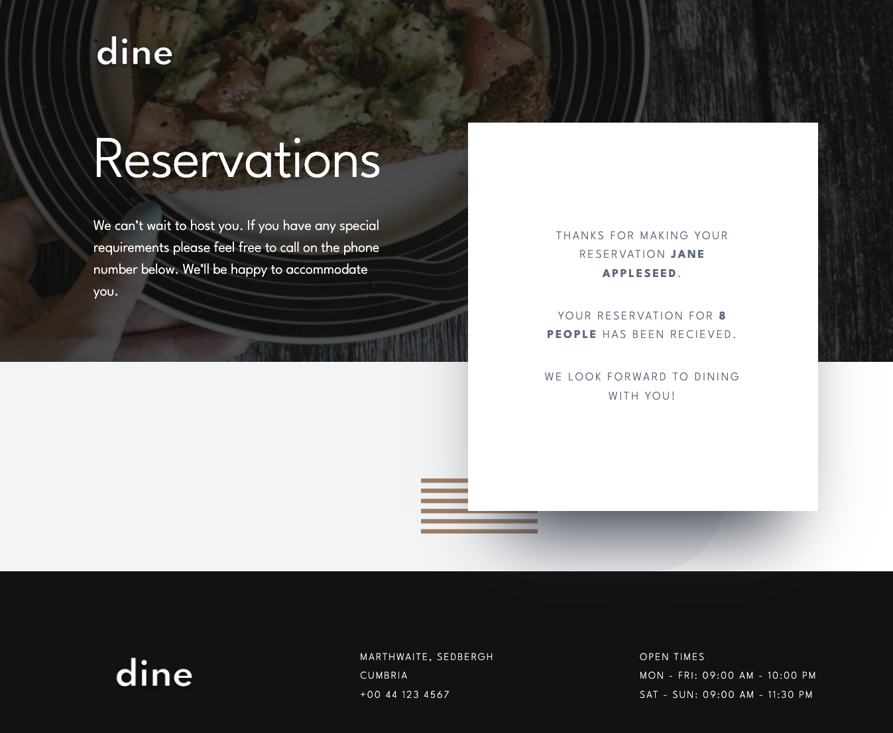

# Frontend Mentor - Dine Website Challenge solution


This is a solution to the [Dine Website Challenge challenge on Frontend Mentor](https://www.frontendmentor.io/challenges/dine-restaurant-website-yAt7Vvxt7). Frontend Mentor challenges help you improve your coding skills by building realistic projects.

## Table of contents

- [Overview](#overview)
  - [Links](#links)
  - [The challenge](#the-challenge)
  - [Screenshots](#screenshots)
- [My process](#my-process)
  - [Built with](#built-with)
  - [What I learned](#what-i-learned)
  - [Continued development](#continued-development)
  - [Useful resources](#useful-resources)
- [Author](#author)
- [Acknowledgments](#acknowledgments)

# Overview
## Links

- Solution URL: [Github Solution](https://github.com/Chanda-Abdul/Frontend-Mentor-Angular-Dine-Restaurant-Website-Challenge)
- Live Site URL: [Live Site ](https://phenomenal-crisp-7a42d8.netlify.app/)
## The challenge

### Users should be able to:

- [x] View the optimal layout for each page depending on their device's screen size
  - [x] Mobile @ `375px`
  - [x] Tablet @ `768px`
  - [x] Desktop @ `1440px`
- [x] See hover states for all interactive elements throughout the site
- [x] See the correct content for the <i>Family Gatherings</i>, <i>Special Events</i>, and <i>Social Events</i> section when the user clicks each tab
- [x] Receive an error message when the booking form is submitted if:
  - [x] The `Name` or `Email Address` fields are empty should show <b>"This field is required"</b>
  - [x] The `Email Address` is not formatted correctly should show <b>"Please use a valid email address"</b>
  - [x] Any of the `Pick a date` or `Pick a time` fields are empty should show <b>"This field is incomplete"</b>

## Screenshots

<details>
<summary><b> Mobile Screenshots @ 375px</b></summary>

### Home


### Event Slides


### Booking


### Error States


### Valid Form


### Confirmation after form submission


</details>
<details>
<summary><b>Tablet Screenshots @ 768px</b></summary>


### Home


### Event Slides


### Booking


### Error States


### Valid Form


### Confirmation after form submission

</details>
<details>
<summary><b>Desktop Screenshots @ 1440px</b></summary>

###  Home


### Event Slides


### Booking


### Error States


### Valid Form


### Confirmation after form submission


</details>


## My process

### Built with

- <b>[Angular](https://angular.io/)</b> (<b>JavaScript</b> framework)
  - <s>[Angular Material](https://material.angular.io/)</s>
  - Reactive Forms 😭
  - [RxJs](https://rxjs.dev/guide/overview) - library for composing asynchronous and event-based programs by using observable sequences.
  - TypeScript
  - JavaScript
    - ⏰ [Moment.js ](https://momentjs.com/docs) - To validate reservation dates and times
- <b>Figma</b>
- <b>Sass/CSS</b> custom properties(❗️this project required <i>ALOT</i> of CSS)
  - <s><b>[fxLayout API](https://github.com/angular/flex-layout/wiki/fxLayout-API)</b> Angular Flexbox API</s>
  - <b>Mobile-first</b> workflow
- Semantic <b>HTML5</b> markup


## What I learned

## How to build Angular Reactive Forms with custom validation
I created the reservation form in the `booking` component using [Angular Reactive forms](https://angular.io/guide/reactive-forms).  I also added custom validation for `input` and `select`
### `rezzo-form.component.html`
```html
<form novalidate
        class="rezForm"
        (ngSubmit)="saveReservation()"
        [formGroup]="rezzoForm">
        ...
        <!-- Name Input -->
      <input class="form-control form-input full"
             type="text"
             placeholder="Name"
             formControlName="name"
             [ngClass]="{'alert-danger': nameValidationErrorMessage }" />
      <span class="alert-danger">
        {{nameValidationErrorMessage}}
      </span>
          ...

  <div class="group">
        <!-- Date Input -->
        <div class="error">
          <h3 
          [ngClass]="{'alert-danger': 
          dateValidationErrorMessage }">Pick a Date</h3> 
          <span class="alert-danger">{{dateValidationErrorMessage}}</span>
        </div>
        <div formGroupName="dateGroup"
             class="dates">
          <!-- Month Select -->
          <select formControlName="month"
                  type="text"
                  class="form-control form-select small date"
                  [ngClass]="{'alert-danger': dateValidationErrorMessage }">
            <option disabled>MM</option>
            <option *ngFor="let month of months">
              {{ month }}
            </option>
          </select>
              ...
        </div>
      </div>
      <span class="alert-danger mobile">{{dateValidationErrorMessage}}</span>
          ...
          <button class="btn btn-light"
              type="submit"
              [disabled]="!rezzoForm.valid"> Make
        Reservation</button>
    </div>
```
#### Custom validation in the component class `rezzo-form.component.ts`
```ts

private nameValidationMessages: any = {
    required: 'Please enter your name.',
    minlength: 'Name must be longer than 4 characters.'
  }
...

this.rezzoForm = this.fb.group({
  name: ['', [Validators.required, Validators.minLength(4)]],
  ...
});

...

const nameControl = this.rezzoForm.get('name');
nameControl.valueChanges.pipe(
  debounceTime(1000)
  ).subscribe(
    (value: any) =>
    this.setNameValidationErrorMessage(nameControl));
...

setNameValidationErrorMessage(n: AbstractControl): void {
    this.nameValidationErrorMessage = '';
    if ((n.touched || n.dirty) && n.errors) {
      this.nameValidationErrorMessage = Object.keys(n.errors).map(
        key => this.nameValidationMessages[key]).join(' ')
    }
  }
...
```
## Creating a custom component to display responsive images
This project contained many images that would change at each breakpoint.  I created a seperate component to render images responsively, using [Attribute Binding](https://angular.io/guide/attribute-binding)
### The template
`picture-responsive.html`
```html
<picture>
  <source media="(min-width: 900px)"
          srcset='/assets/images/homepage/{{imageTitle}}-desktop.jpg'>
  <source media="(min-width: 600px)"
          srcset='/assets/images/homepage/{{imageTitle}}-tablet.jpg'>
  
</picture>
```
### The component class
```ts
<app-picture-responsive *ngIf="selectedEvent"
  imageTitle="{{selectedEvent.imageTitle}}"
  class="event-photo"></app-picture-responsive>
```

#### The data

```ts

...
EventItem[] = [
  {
    id: 1,
    ...
    imageTitle: "family-gathering",
    mobileImage: "../assets/images/homepage/family-gathering-mobile.jpg",
    tabletImage: "../assets/images/homepage/family-gathering-tablet.jpg",
    desktopImage: "../assets/images/homepage/family-gathering-desktop.jpg"
  },
  ...
  ```
## ⏰ [Moment.js](https://momentjs.com/docs) library for custom form validation
I used the [Moment.js](https://momentjs.com/docs) library to validate the `date` and `time` selects before displaying error messages


### 🙅🏽‍♀️ `rezzo-form.component.ts`

```ts
...

setDateValidationErrorMessage(month, day, year): void {
  this.dateValidationErrorMessage = '';
  let now = moment();
  let reservation = moment([year.value, moment(month.value, 'MMM').month(), day.value]);
  let later = moment().add(6, 'months');

  if (!reservation.isValid() || now > reservation || reservation > later) {
    this.dateValidationErrorMessage = 'Please select a valid date within the next 6 months'
  }
}
...
  ```

## Continued development
This <b>Dine</b> project would be a good opportunity to add several useful/interesting features.  Usually it is challenging to create ideas for extras to add to these projects. A few features I would like to add are listed below.
### Features to Add

➕ <b> Cool animations</b>, this could be a good project to practice [parallex](https://webflow.com/blog/parallax-scrolling), and play with Angular or CSS animations

➕ <b> Authenticate/Authorization with ability to update</b>

  - [ ] Add authentication /Authorization
  - [ ] Login/logout, with a password, for managers/admins so that they can update menu options, reservations, and events
    - [ ] view/edit menu options
    - [ ] view/edit menu event options
    - [ ] view/edit menu reservations
  - [ ] button? reset to default menu/event data default. for testing purposes
  
➕ <b> Authenticate/Authorization with ability to view only</b>
  - [ ] add a view only option for admins to view menu, reservations, and events

➕ <b> Menu Page</b>
  - [ ] add menu component to show list of all current offerings.
<!-- many resturaunt sites have a menu for users to view. -->
➕ <b> About page</b>
  - [ ] add about chef/restaraunt section/page

➕ <b> Event Booking Component</b>
  - [ ] add event booking component so that users can book events, similar to the reservation component
#
### Useful resources

- 🙌🏾 [Angular Reactive Forms By Deborah Kurata(Pluralsight Course)](https://app.pluralsight.com/library/courses/angular-2-reactive-forms/table-of-contents) - This is an amazing YouTube which helped me understand how to build Reactive Forms with Angular. I'd recommend it to anyone still learning this concept.
- ⏰ [Moment.js ](https://momentjs.com/docs) - To validate reservation dates and times
- [Reactive forms](https://angular.io/guide/reactive-forms) - This helped me... I really liked this pattern and will use it going forward.
- 🙌🏾 [Angular Reactive Forms in 10 Minutes](https://youtu.be/MMP_OcjWNQo) - This is an amazing YouTube which helped me finally understand how to build Reactive Forms with Angular. I'd recommend it to anyone still learning this concept.
- [/angular/flex-layout](https://github.com/angular/flex-layout) - <s>This helped me because it's much easier to incorporate <b>Flexbox</b> into a <b>template</b> than a <b>CSS</b> stylesheet 🤔 . I really liked this pattern and will use it going forward.</s> Now, I prefer to create flex styles with <i>Sass</i>
- [Udemy: Angular (Full App) with Angular Material, Angularfire & NgRx Created by Maximilian Schwarzmüller](https://www.udemy.com/share/101WvC3@iwU-zs0EjLuBHrh2IFqrITl0TXzocf5BeqTXM5rBHhVGmHco65hhIW8VnrsMxYA=/) - Great Tutorials. Would Recommend.
- [Managing Image Breakpoints With Angular](https://www.smashingmagazine.com/2019/02/image-breakpoints-angular/) - Yes. Then I moved the resonsive images into a seperate component👌🏽
- [Using forms for user input](https://angular.io/start/start-forms) - 🤷🏽‍♀️
- [Angular 13 Select Dropdown with Reactive Forms Examples](https://www.positronx.io/angular-select-dropdown-with-reactive-forms-examples/) - This is an amazing article which helped me finally understand XYZ. I'd recommend it to anyone still learning this concept.

## Author

- Frontend Mentor - [@Chanda-Abdul](https://www.frontendmentor.io/profile/Chanda-Abdul)
- Website - [Chanda Codes](https://chandacodes.com/)
- GitHub - [github.com/Chanda-Abdul](https://github.com/Chanda-Abdul)

## Acknowledgments
